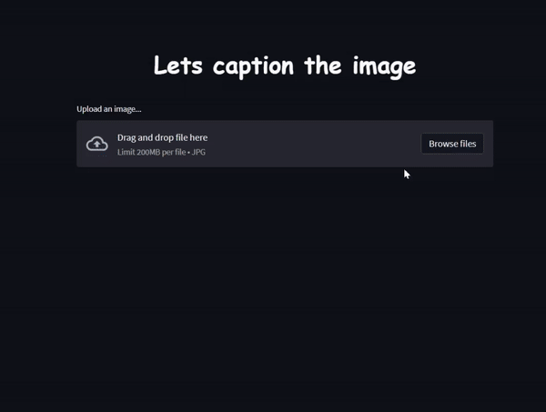
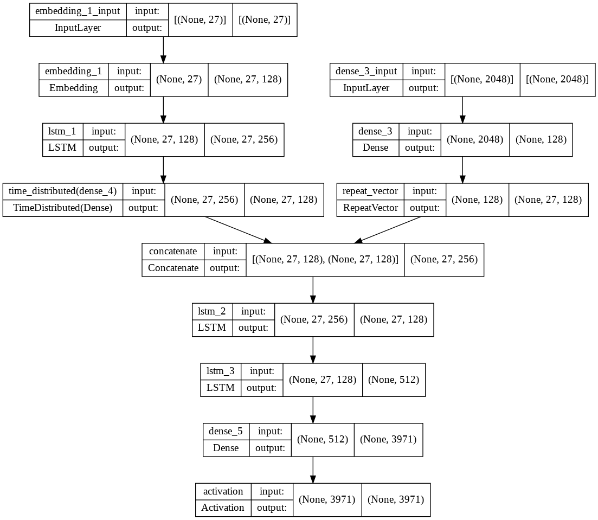

## Image Captioning
Image Captioning is an encoder decoder mode based on sequence to sequence learning. It takes a image as input and generates a caption describing the event in the image.

## Demo

## Dataset
This project is build on the Flickr8K dataset consisting of 8,000 images that are each paired with five different captions which provide clear descriptions of the salient entities and events. The images were chosen from six different Flickr groups, and tend not to contain any well-known people or locations, but were manually selected to depict a variety of scenes and situations

## Model
### Architecture

* **Loss : Categorical Crossentropy**
* **Metric :Accuracy**

## Applications of Image Captioning

* *Probably, will be useful in cases/fields where text is most used and with the use of this, you can infer/generate text from images. As in, use the information directly from any 
particular image in a textual format automatically.*

* *There are many NLP applications right now, which extract insights/summary from a given text data or an essay etc. The same benefits can be obtained by people who would benefit from automated insights from images.*

* *A slightly (not-so) long term use case would definitely be, explaining what happens in a video, frame by frame.*

* *Would serve as a huge help for visually impaired people. Lots of applications can be developed in that space.*

* *Social Media Platforms like facebook can infer directly from the image, where you are ( beach, cafe etc), what you wear (color) and more importantly what you’re doing also (in a way). See an example to understand it better.*

<h3 id="Performance">Performance of Model on testing data</h3>
<table>
 <tr>
  <th>Image</th>
 <th>Caption(Time taken)</th>
 </tr>
<tr>
 <td></td>
 <td>a woman is seasoning some food(22.05s)</td>

 </tr>
